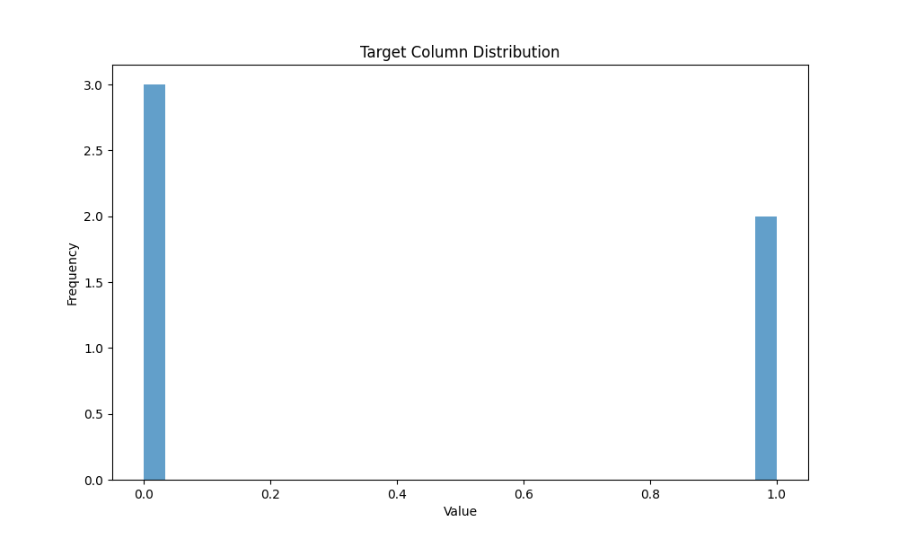
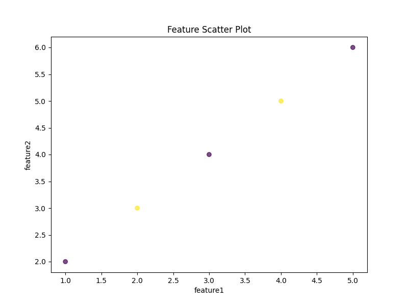

# CSVデータから統計・可視化・機械学習を一括実行するPythonアプリ

CSVファイルを入力するだけで、統計量の出力・グラフによる可視化・機械学習モデルの作成と評価までを一括で実行できる、Dockerと仮想環境に対応した再現性の高いデータ分析自動化ツールです。

---

## 処理の流れ

**CSV入力 → 統計量出力 → 可視化（グラフ生成）→ 機械学習（分類）→ モデル評価**

---

## 開発背景

「データ分析や機械学習を学びたい初心者が、環境構築や手順でつまずかず、すぐに実践できるアプリが欲しい」と考え、実務でも使える再現性・汎用性を意識して開発しました。

---

## 想定ユーザー

- Pythonやデータ分析・機械学習の学習を始めたい初心者
- 業務データの可視化や分類モデル作成を手早く試したい方
- ポートフォリオやGitHub公開用の実用的なサンプルを探している方

---

## 特長

- **1コマンドで「統計量出力→グラフ化→機械学習モデル作成・評価」まで自動実行**
- **仮想環境（venv）・Docker両対応で、環境差なく再現可能**
- **全手順をREADMEに明記、初心者でも迷わず実行できる**
- **実務で使える「データ前処理・可視化・モデル評価」まで網羅**
- **コピペで使えるコマンド例を多数掲載**

---

## 実行イメージ・出力例

1. **データの統計情報出力**
    ```
       feature1  feature2  target_column
    count      5.0       5.0            5.0
    mean       3.0       4.0            0.4
    std        1.58      1.58           0.55
    min        1.0       2.0            0.0
    max        5.0       6.0            1.0
    ```

2. **グラフ表示（matplotlibウィンドウで自動表示）**
    - ターゲット列（予測したい項目）のヒストグラム
    - 特徴量同士の散布図

    
    

    ※サンプル画像は `screenshots/` フォルダに格納しています。実行時に同様のグラフが自動生成されます。

3. **モデルの評価結果**
    ```
    Model Accuracy: 0.80
    ```

> ※input.csvの内容を変えるだけで、これらの出力が自動的に更新されます。

---

## 入力データ（input.csv）の前提

- すべて数値データのCSVファイルを想定
- 「target_column」という名前のターゲット列（予測したい項目）を必ず含めてください

---

## フォルダ構成

```
python-training/
├── src/
│   ├── main.py
│   ├── utils.py
│   └── mytypes/
│       └── __init__.py
├── data/
│   └── input.csv
├── requirements.txt
├── Dockerfile
├── docker-compose.yml
├── screenshots/
│   ├── histogram.png
│   └── scatter.png
└── README.md
```

---

## セットアップ・実行手順

### 1. 仮想環境（venv）での実行

#### 【Windowsコマンドプロンプト/PowerShell】

```sh
cd python-training
python -m venv .venv
.venv\Scripts\activate
pip install -r requirements.txt
python src/main.py
```

#### 【Git Bash（Windows）】

```sh
cd python-training
python -m venv .venv
source .venv/Scripts/activate
pip install -r requirements.txt
python src/main.py
```

#### 【WSL / Linux / Mac】

```sh
cd python-training
python -m venv .venv
source .venv/bin/activate
pip install -r requirements.txt
python src/main.py
```

---

### 2. Dockerでの実行

#### 【全OS共通・推奨：docker compose】

まずは以下を実行してください（最も簡単な方法です）。

```sh
cd python-training
docker compose up --build
```

この方法は環境差なく再現できるため、最も簡単で確実です。

> ※「とにかくすぐ動かしたい」「初心者の方」はこの方法を推奨します。

---

#### 【補足：個別dockerコマンド（OS別）】

docker composeが使えない場合や、細かくコントロールしたい場合は、下記のOS別コマンドを利用してください。

- **Windows（PowerShell）**
    ```sh
    cd python-training
    docker build -t pyproj .
    docker run --rm -it -v ${PWD}\data:/app/data -v ${PWD}\screenshots:/app/screenshots pyproj
    ```

- **Windows（コマンドプロンプト）**
    ```bat
    cd python-training
    docker build -t pyproj .
    docker run --rm -it -v %cd%\data:/app/data -v %cd%\screenshots:/app/screenshots pyproj
    ```

- **Mac / Linux**
    ```sh
    cd python-training
    docker build -t pyproj .
    docker run --rm -it -v $(pwd)/data:/app/data -v $(pwd)/screenshots:/app/screenshots pyproj
    ```

> どの方法を使えばよいか迷った場合は、まず「docker compose」の方法をお試しください。

---

## 使用技術

- Python 3.11
- pandas
- matplotlib
- numpy
- scikit-learn
- Docker / docker-compose

---

## 注意事項・カスタマイズ

- `data/input.csv` を編集することで、独自データでも簡単に試せます
- コードや構成の改善はプルリクエスト歓迎です
- 実行時にエラーが出る場合は、PythonやDockerのバージョン、パス設定等をご確認ください

---

## コピペで使えるコマンドまとめ

### 仮想環境（venv）

- **Windowsコマンドプロンプト/PowerShell**
    ```sh
    cd python-training
    python -m venv .venv
    .venv\Scripts\activate
    pip install -r requirements.txt
    python src/main.py
    ```

- **Git Bash（Windows）**
    ```sh
    cd python-training
    python -m venv .venv
    source .venv/Scripts/activate
    pip install -r requirements.txt
    python src/main.py
    ```

- **WSL / Linux / Mac**
    ```sh
    cd python-training
    python -m venv .venv
    source .venv/bin/activate
    pip install -r requirements.txt
    python src/main.py
    ```

---

### docker compose（全OS共通・推奨）

まずは以下を実行してください（最も簡単な方法です）。

```sh
cd python-training
docker compose up --build
```

この方法は環境差なく再現できるため、最も簡単で確実です。

---

### dockerコマンド（OS別）

- **Windows（PowerShell）**
    ```sh
    cd python-training
    docker build -t pyproj .
    docker run --rm -it -v ${PWD}\data:/app/data -v ${PWD}\screenshots:/app/screenshots pyproj
    ```

- **Windows（コマンドプロンプト）**
    ```bat
    cd python-training
    docker build -t pyproj .
    docker run --rm -it -v %cd%\data:/app/data -v %cd%\screenshots:/app/screenshots pyproj
    ```

- **Mac / Linux**
    ```sh
    cd python-training
    docker build -t pyproj .
    docker run --rm -it -v $(pwd)/data:/app/data -v $(pwd)/screenshots:/app/screenshots pyproj
    ```

---

## ライセンス

MIT License
